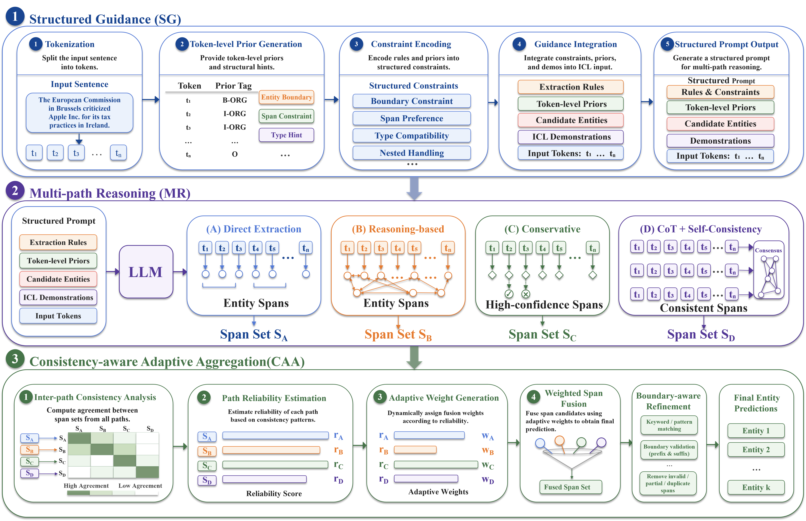

# SGMR-NER


## Data Preparation
Please save your dataset in `data` folder. Note that CoNLL03 and WNUT17 are open-source datasets, ACE04 and ACE05 are not free. We keep our CoNLL03 and WNUT17 train and test JSON files in `data` folder.

- CoNLL03: [https://huggingface.co/datasets/conll2003](https://huggingface.co/datasets/conll2003)
- WNUT17: [https://huggingface.co/datasets/wnut_17](https://huggingface.co/datasets/wnut_17)
- ACE04: [https://catalog.ldc.upenn.edu/LDC2005T09](https://catalog.ldc.upenn.edu/LDC2005T09)
- ACE05: [https://catalog.ldc.upenn.edu/LDC2006T06](https://catalog.ldc.upenn.edu/LDC2006T06)

## Generation
All experiments are conducted under a 5-shot in-context learning setting.
Therefore, `icl_cnt` is fixed to 5.

Please review `generate.py` for SGMR-NER and `utils.py` for prompts, and change some important parameters.
```{bash}
python generate.py --dataset your_dataset --mode your_mode --picl_cnt your_picl_cnt --icl_cnt 5

```

## Evaluation

Please review `eval.py` for computing entity-level F1 score.
```{bash}
python eval.py --label_path your_label_file_path --pred_path your_model_output_file_path

```
